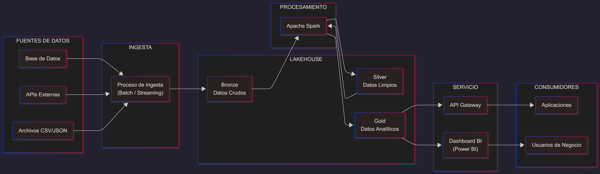

# Proyecto Lakehouse – Gestión de Datos para IA

## Descripción del Proyecto
Este proyecto implementa una plataforma de gestión y análisis de datos basada en arquitectura Lakehouse, orientada al procesamiento de información de un sistema tipo IAMarket.

La solución permite integrar múltiples fuentes de datos, almacenarlas en distintas capas (Bronze, Silver y Gold), procesarlas mediante Apache Spark y exponer los resultados a través de dashboards y servicios API.

El sistema está diseñado para soportar tanto datos estructurados como no estructurados, y sirve como base para futuras aplicaciones de inteligencia artificial.

---

## Arquitectura Seleccionada
Se utiliza una arquitectura Lakehouse, que combina las ventajas de un Data Lake y un Data Warehouse, permitiendo almacenamiento escalable y análisis eficiente.

### Modelo Medallion

| Capa   | Descripción |
|--------|------------|
| Bronze | Datos crudos sin procesar |
| Silver | Datos limpios y estructurados |
| Gold   | Datos listos para análisis |

### Flujo de Datos

Fuentes → Ingesta → Bronze → Procesamiento (Apache Spark) → Silver → Gold → Servicio → Usuarios

---

## Requisitos y Configuración del Entorno

### Herramientas necesarias

- Git  
- Docker  
- Python 3.9 o superior  
- Apache Spark  
- PostgreSQL (opcional)  
- Power BI o herramienta de visualización equivalente  

### Requisitos del sistema

- Sistema operativo: Windows, Linux o macOS  
- Memoria RAM: 8 GB recomendados  
- Espacio en disco: mínimo 10 GB  

---

## Instrucciones de Instalación

### 1. Clonar el repositorio
```bash
git clone https://github.com/TU-USUARIO/Proyecto_gestion_BearpAI.git
cd Proyecto_gestion_BearpAI


